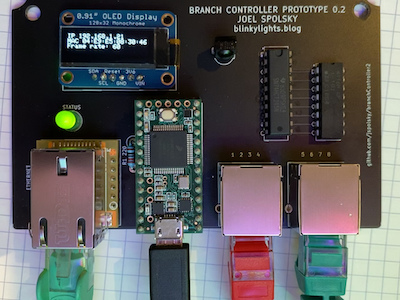

branchController
================

The Branch Controller is a small hardware board based on the [Teensy 3.2 development board](https://www.pjrc.com/store/teensy32.html) to allow it to control up to 8 separate pixel-addressible LED strips.

Although it can be used standalone to send its own patterns to the light strips, it really shines when connected, over ethernet, to a network. That allows you to generate the patterns on a computer (say, with a high powered graphics card) and send them to one or more Branch Controllers. In particular you can drive a lot more LEDs than any single controller can drive by using multiple Branch Controllers.

It is designed for WS2812b-style LED strips, with a single wire protocol. These are what Adafruit calls "NeoPixels".

Personally I like to use the WS2815 variant which runs on 12 volts and has a backup wire allowing any single pixel to fail. It does *not* handle APA102c-type strips, which use a two wire protocol consisting of both the signal and a clock.

Features:

* Supports up to 4400 pixels (550 per strip) at a frame rate of 60 Hz, the theoretical limit of the protocol

* Ethernet control. Connects to an ethernet network to receive pixel data. This allows you to use many branch controllers controlled from a single PC

* Optional 128x32 OLED display for diagnostics and network configuration

* IR sensor allows you to use an IR remote control for basic controls

Basic Operation
---------------

By default branchController assumes you have 8 strips of 550 pixels each. You can operate a single branchController with a 44 button IR remote control like this one:

The brightness and color buttons work out of the box so you can use your branch controller to create basic solid colors. 

Use the On/Off button on the remote to turn off the LEDs. When you press OFF, any changes you have made to the state of the branchController is saved to EEPROM so that it will come back in the same state when you power up. *If you don't press off, the state is never saved*.

The DIY1-6 buttons are reserved for internal test patterns and chases. You can edit the code for these to provide something that is a good backup if your PC or network fails.

DIY1 shows a test pattern where the first pixel is brown on the first strip, the first two pixels are brown on the second strip, etc. This is useful for making sure you have the 8 strips hooked up in the right order.

Network Operation
-----------------

You can connect your branchController to a LAN using the built-in ethernet port and control it from any kind of computer over IP.

When branchController starts up, it will look for a DHCP server and try to get an IP address and network configuration. If that works it will show you the IP address on the screen.

Every branch controller has a unique MAC address which will never change, so you can configure your DHCP server to always hand out the same IP address to the same branch controller, which makes it easier to sort out multiple branch controllers.

Web-based Hardware Configuration
--------------------------------

If you don't like the default configuration, you can use a web browser to connect to your
branchController and modify some things:

* the maximum power that LEDs will be allowed to consume (in milliwatts). If the total power budget is exceeded, all LEDs will be dimmed equally.
* the RGB order in your LED strips (some strips expect RGB, others expect GRB). Use the "red", "green", and "blue" buttons to diagnose incorrect RGB order.
* the color correction you want applied to all output, as a six digit hex RGB value
* the color temperature you want applied to all output, as a six digit hex RGB value
* the overall brightness of the LEDs, on a scale from 0 (off) to 255 (full). This can
  also be adjusted with an IR remote

See http://fastled.io/docs/3.1/group___color_enums.html for options for color correction and 
color temperature.

Open Pixel Control
------------------

If branchController successfully gets on the Internet, it will listen for UDP messages on port 7890, where it will receive data sent to it using the Open Pixel Control format, documented [here](http://openpixelcontrol.org/). You can use Christopher Schardt's app [L.E.D. Lab](https://apps.apple.com/us/app/l-e-d-lab/id832042156) for iPhone or iPad to send cool animations. LED Lab supports Open Pixel Control natively.

**LIMITATION** Due to the maximum size of Ethernet packets around 1500, the Open Pixel Control only allows you to have up to 480 pixels per strip.

About the project
-----------------

This code was built using PlatformIO, an open source platform for embedded development which is a zillion times better than using the Arduino IDE. You will still need Teensyduino to flash the Teensy. For more about the research behind this project, follow my blog, [BlinkyLights](https://blinkylights.blog/).

Want to build one?
-------------------
* The gerber directory has gerber and drill files so you can order PCBs.
* I might have a few extra PCBs if you want one or two for a noncommercial project (joel@spolsky.com).
* This [BOM](https://octopart.com/bom-tool/tv6ZDeDl) lists the parts you need.
* The PCB is designed to be mounted in a Polycase SK-16-03 if you want a weatherproof enclosure

Next Up
-------

- [ ] "Count Pixels" mode
- [ ] UDP support for Open Pixel Control
        NOTE - this works now (in udp branch). Before I merge it in I need to decide 
        whether to continue to support TCP for > 480 pixels, or just change this project
        to be 480 pixels max.
- [ ] Improve power limiting feature by showing stats on display for diagnosis
- [ ] Static IP address
- [ ] Multicast DNS (mDNS) and service discovery (DNS-SD)
      try https://github.com/TrippyLighting/EthernetBonjour
- [X] Faster brightness adjust
- [ ] Investigate temporal dithering - it's not really happening. 
- [ ] Internet cable disconnected / reconnected
- [ ] Better built-in (DIY1-6) displays maybe
- [ ] Support remote control Play/Pause button for internal DIY1-6 displays
- [ ] Either implement gamma correction or stop pretending
- [ ] TouchDesigner support
- [ ] DMX/ArtNet bridge mode
