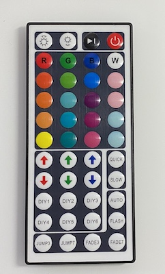

branchController
================

Teensy 3.2 branch controller for up to 8 separate LED strips, based on instructions received over TCP-IP.

This is code that runs on the [Teensy 3.2 development board](https://www.pjrc.com/store/teensy32.html) to allow it to control up to 8 separate LED strips.

It is designed for WS2812b-style LED strips, with a single wire protocol. These are what Adafruit calls "NeoPixels". Personally I like to use the WS2815 variant which runs on 12 volts and has a backup wire allowing any single pixel to fail. It does *not* handle APA102c-type strips, which use a two wire protocol consisting of both the signal and a clock.

Features:

* Supports up to 4400 pixels (550 per strip) at a frame rate of 60 Hz, the theoretical limit of the protocol

* Ethernet control. Connects to an ethernet network to receive pixel data. This allows you to use many branch controllers controlled from a single PC

* 128x32 OLED display for diagnostics and network configuration

* IR sensor allows you to use an IR remote control for basic controls

Basic Operation
---------------

By default branchController assumes you have 8 strips of 550 pixels each. You can operate a single branchController with a 44 button IR remote control like this one:

The brightness and color buttons work out of the box so you can use your branch controller to create basic solid colors. 

Use the On/Off button on the remote to turn off the LEDs. When you press OFF, any changes you have made to the state of the branchController is saved to EEPROM so that it will come back in the same state when you power up. *If you don't press off, the state is never saved*.

The DIY1-6 buttons are reserved for internal test patterns and chases. You can edit the code for these to provide something that is a good backup if your PC or network fails.

Network Operation
-----------------

You can connect your branchController to a LAN using the built-in ethernet port and control it from any kind of computer that speaks TCP/IP.

When branchController starts up, it will look for a DHCP server and try to get an IP address and network configuration. If that works it will show you the IP address on the screen.

Every branch controller has a unique MAC address which will never change, so you can configure your DHCP server to always hand out the same IP address to the same branch controller, which makes it easier to sort out multiple branch controllers.

Web-based Hardware Configuration
--------------------------------

If you don't like the default configuration, you can use any web server to connect to your
branchController and modify some things:

* the maximum power that LEDs will be allowed to consume (in milliwatts). If the total
  power budget is exceeded, all LEDs will be dimmed equally.
* the RGB order in your LED strips (some strips expect RGB, others expect GRB). Use the
  "red", "green", and "blue" buttons to diagnose incorrect RGB order.
* the color correction you want applied to all output, as a six digit hex RGB value
* the color temperature you want applied to all output, as a six digit hex RGB value
* the overall brightness of the LEDs, on a scale from 0 (off) to 255 (full). This can
  also be adjusted with an IR remote
* whether or not you want Gamma Correction applied to improve the colors

See http://fastled.io/docs/3.1/group___color_enums.html for options for color correction and 
color temperature.

See https://learn.adafruit.com/led-tricks-gamma-correction/the-issue for info on how we apply
gamma correction.

Open Pixel Control
------------------

If branchController successfully gets on the Internet, it will listen for TCP connections on port 7890, where it will receive data sent to it using the Open Pixel Control format, documented [here](http://openpixelcontrol.org/). You can use Christopher Schardt's app [L.E.D. Lab](https://apps.apple.com/us/app/l-e-d-lab/id832042156) for iPhone or iPad to send cool animations -- all you need to do is set up the controller as if it were a FadeCandy controller.

About the project
-----------------

This code was built using PlatformIO, an open source platform for embedded development which is a zillion times better than using the Arduino IDE. You will still need Teensyduino to flash the Teensy. For more about the research behind this project, follow my blog, [BlinkyLights](https://blinkylights.blog/).

Are you making one?
-------------------
Here's [a BOM](https://octopart.com/bom-tool/tv6ZDeDl) with all the parts you need 

Next Up
-------

- [ ] Optimize frame rate
- [ ] Show IP address double size once DHCP is connected. Don't show MAC address after successful connection
- [ ] Internet cable disconnected / reconnected
- [ ] Investigate temporal dithering. If we have fewer pixels, maybe we have time to do it.
- [X] Implement power limiting function (Max watts)
- [ ] Improve power limiting feature by show stats on display for diagnosis
- [ ] Better built-in (DIY1-6) displays maybe
- [ ] Support remote control Play/Pause button for internal DIY1-6 displays
